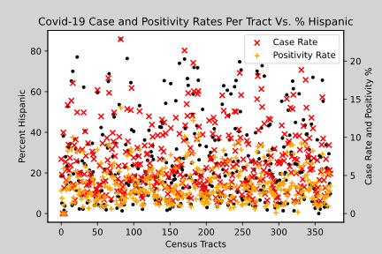

# covid19race
Notebooks comparing Census data and County of Santa Clara Covid-19 health data

### https://github.com/Benitoite/covid19race/blob/main/covid19race.ipynb
    Notebook comparing Covid-19 Positivity, Case Rate, and Vacc12 Rates per Census Tract by Percent White Only

    </img>

