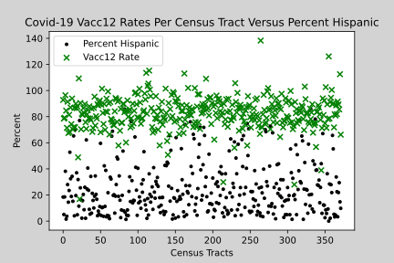
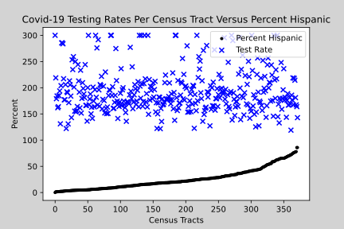

# covid19race
Notebooks comparing Census data and County of Santa Clara Covid-19 health data

### https://github.com/Benitoite/covid19race/blob/main/covid19race.ipynb
    Notebook comparing Covid-19 Positivity, Case Rate, and Vacc12 Rates per Census Tract by Percent White Only

| </img> |
| :---: |
| *Figure 1. Unsorted plot of Case and Positivity Rate data* |

 
| </img> |
| :---: |
| *Figure 2. Sorted plot of Case and Positivity Rate data* |
 
| </img> |
| :---: |
| *Figure 3. Unsorted plot of Vacc12 data* |

| </img> |
| :---: |
| *Figure 4. Sorted plot of Vacc12 data* |

| </img> |
| :---: |
| *Figure 5. Sorted plot of Testing Rate data* |

| </img> |
| :---: |
| *Figure 6. Sorted plot of Testing Rate data* |

### https://github.com/Benitoite/covid19race/blob/hisp/covid19race.ipynb
    Notebook comparing Covid-19 Positivity, Case Rate, and Vacc12 Rates per Census Tract by Percent Hispanic

| </img> |
| :---: |
| *Figure 1. Unsorted plot of Case and Positivity Rate data* |

 
| </img> |
| :---: |
| *Figure 2. Sorted plot of Case and Positivity Rate data* |
 
| </img> |
| :---: |
| *Figure 3. Unsorted plot of Vacc12 data* |

| </img> |
| :---: |
| *Figure 4. Sorted plot of Vacc12 data* |

| </img> |
| :---: |
| *Figure 5. Sorted plot of Testing Rate data* |

| </img> |
| :---: |
| *Figure 6. Sorted plot of Testing Rate data* |

